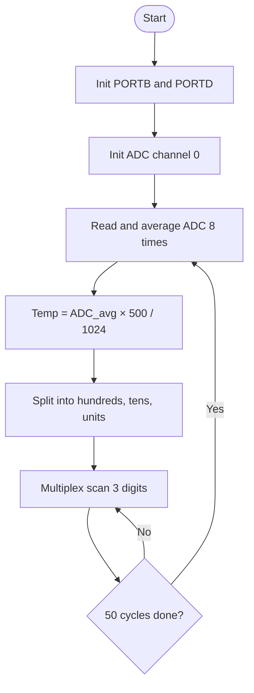

# Software Flowchart

## Pseudocode

```
START
    Set PORTB as output (segments)
    Set PORTD bits 0-2 as output (digit select)
    Initialize ADC on channel 0

    LOOP forever
        Read ADC 8 times and calculate average
        Temperature = average × 500 / 1024

        hundreds = temperature / 100
        tens     = (temperature / 10) % 10
        units    = temperature % 10

        Repeat 50 times
            Show hundreds digit on display 1
            Show tens digit on display 2
            Show units digit on display 3
        End repeat
    END LOOP
END
```

## Flowchart


