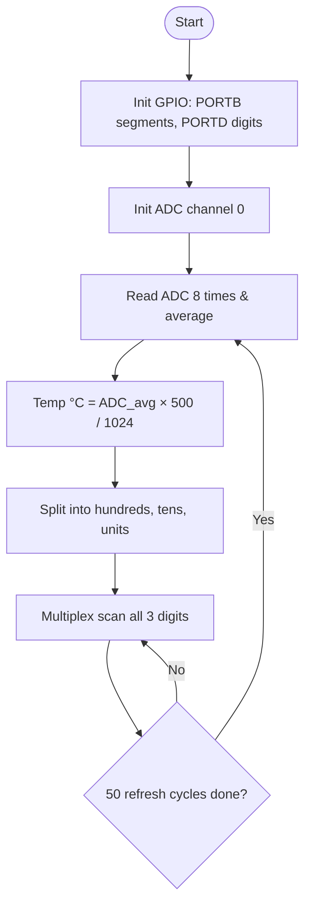

# Software Flowchart — Digital Thermometer

## Pseudocode

```
BEGIN
    Configure PORTB as output (7-segment segments)
    Configure PORTD bits 0-2 as output (digit select)
    Initialize ADC (channel 0, AVCC ref, prescaler 64)

    LOOP forever
        temp = 0
        REPEAT 8 times
            temp = temp + ADC_READ()
            DELAY 2 ms
        END REPEAT
        temp = (temp / 8) × 500 / 1024    // °C from LM35

        hundreds = temp / 100
        tens     = (temp / 10) MOD 10
        units    = temp MOD 10

        REPEAT 50 times                    // refresh display ~50 ms
            REPEAT for each digit (H, T, U)
                Turn OFF all digits
                Look up segment pattern for current digit
                Write pattern to PORTB
                Enable current digit on PORTD
                DELAY 1 ms
            END REPEAT
        END REPEAT
    END LOOP
END
```

## Flowchart (Mermaid — paste into report or draw.io)



## Design considerations (for Methodology section)

1. **LM35 interface** — Direct analog connection; no extra amplifier needed for 0–100 °C on 5 V ADC.
2. **ADC averaging** — 8-sample mean reduces noise from Proteus simulation and real hardware.
3. **Multiplexing** — 3 digits share one 7-pin segment bus; only 10 MCU pins instead of 21.
4. **Leading zero blanking** — Hundreds digit hidden when temperature &lt; 100 °C (shows `37` not `037`).
5. **Range clamp** — Limited to 0–199 °C for 3-digit display.
